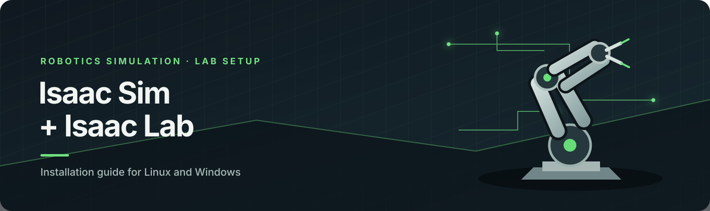

<p align="center">
  
</p>

# Install NVIDIA Isaac Sim 6.0 and Isaac Lab

This guide is for new lab members setting up a local workstation on **Ubuntu Linux** or **Windows 10/11**. It installs Isaac Sim 6.0.0 and the matching Isaac Lab 3.0 beta using the Isaac Sim Python package and the Isaac Lab source repository.

> **Version note:** The supplied Isaac Sim docs are for 6.0.0. For Isaac Lab, this tutorial uses the `v3.0.0-beta` release branch, whose quickstart pairs with Isaac Sim 6.0.0. Avoid combining Isaac Sim 6.0 with Isaac Lab 2.x or an unrelated `main` branch. If the lab has a pinned branch or environment file, use that instead.

## Before you start

- Use a supported NVIDIA RTX GPU with a current NVIDIA driver. Check the [Isaac Sim 6.0 system requirements](https://docs.isaacsim.omniverse.nvidia.com/6.0.0/installation/requirements.html) before installing; Isaac Sim is demanding and integrated graphics are not sufficient.
- Set aside at least **50 GB** free disk space for the download, caches, and project files.
- Install Git and `uv` (the Python environment/package manager used in the commands below). See [uv installation](https://docs.astral.sh/uv/getting-started/installation/) and [Git downloads](https://git-scm.com/downloads).
- Use a stable internet connection for the Python packages and simulation assets.
- On Windows, use a short path without spaces, for example `C:\lab\IsaacLab`.

## Remove an old Isaac Sim or Isaac Lab install

There is no single uninstaller for every install method. First close Isaac Sim and any training processes. **Keep a copy of projects, USD scenes, checkpoints, and custom assets you need.** Delete only the folders you recognize as belonging to your old install; do not run broad wildcard deletion commands.

### Isaac Lab source checkout and Python environment

The Isaac Lab checkout is just a Git folder, and the `env_isaaclab` folder is its Python environment. Remove each separately when you no longer need it.

**Linux:**

```bash
# From the parent directory, replace IsaacLab with the actual checkout folder name
rm -rf IsaacLab

# Remove the environment only if it is the one created for Isaac Lab
rm -rf ~/env_isaaclab
```

**Windows (PowerShell):**

```powershell
# Review the path first; these commands permanently remove the folders
Remove-Item -Recurse -Force .\IsaacLab
Remove-Item -Recurse -Force "$HOME\env_isaaclab"
```

If you installed Isaac Sim through `uv` in a different environment, remove that exact environment folder after checking its path. If the environment contains other projects, keep it and uninstall only the packages from that environment instead.

### Standalone Isaac Sim archive install

If you installed from the standalone ZIP, remove the extracted install directory (for example `~/isaacsim` on Linux or `C:\isaacsim` on Windows) after confirming it contains only that Isaac Sim installation. Also remove the downloaded ZIP if you no longer need it. This does not remove a separate Python package installation or projects stored elsewhere.

### Isaac Sim and Omniverse caches (optional)

Caches can be rebuilt and may take time to download or regenerate. Remove them only when troubleshooting corrupted cache data or reclaiming space. You can inspect the folders first and delete only Isaac Sim-related cache directories.

- **Linux:** check `~/.cache/ov` and `~/.local/share/ov`.
- **Windows:** check `%LOCALAPPDATA%\\ov` and `%USERPROFILE%\\.cache\\ov`.

These folders may be shared by multiple Omniverse applications. Do not delete the entire parent folder if another NVIDIA application or project uses it. Refer to NVIDIA's [setup tips](https://docs.isaacsim.omniverse.nvidia.com/6.0.0/installation/install_faq.html) if you are unsure which cache to clear.

For a Python-package install, activate the specific environment and inspect installed Isaac Sim packages before uninstalling:

```bash
python -m pip list | grep -i isaacsim
```

Then uninstall only the Isaac Sim packages from that environment using `python -m pip uninstall isaacsim isaacsim-core isaacsim-app` if those exact package names are listed. Package names can differ by release; review the list and confirm each prompt. Do not uninstall packages from a shared environment without checking with its owner.

## 1. Create a Python environment and install Isaac Sim

The commands below use Python 3.12 and Isaac Sim **6.0.0**. Run commands in a terminal (Linux) or PowerShell (Windows), unless noted.

### Linux (Ubuntu)

```bash
uv venv --python 3.12 --seed env_isaaclab
source env_isaaclab/bin/activate
uv pip install --upgrade pip
uv pip install -U torch==2.10.0 torchvision==0.25.0 --index-url https://download.pytorch.org/whl/cu128
uv pip install "isaacsim[all,extscache]==6.0.0" --extra-index-url https://pypi.nvidia.com
```

### Windows (PowerShell)

```powershell
uv venv --python 3.12 --seed env_isaaclab
.\env_isaaclab\Scripts\Activate.ps1
uv pip install --upgrade pip
uv pip install -U torch==2.10.0 torchvision==0.25.0 --index-url https://download.pytorch.org/whl/cu128
uv pip install "isaacsim[all,extscache]==6.0.0" --extra-index-url https://pypi.nvidia.com
```

If PowerShell blocks environment activation, use **Command Prompt** and activate with `env_isaaclab\Scripts\activate.bat`, or follow Microsoft's [PowerShell execution policy guidance](https://learn.microsoft.com/powershell/module/microsoft.powershell.core/about/about_execution_policies). Do not change a machine-wide policy on a managed lab computer; ask the administrator.

## 2. Check that Isaac Sim starts

Keep the environment active. Start Isaac Sim in headless mode for a quick installation check:

```bash
python -m isaacsim --no-window
```

The first start may take several minutes while shaders and caches are prepared. Wait for the process to finish loading; do not close it just because the window has not appeared immediately. For a GUI launch, run `python -m isaacsim`.

## 3. Download and install Isaac Lab

Open a **new terminal** (Linux) or **new PowerShell window** (Windows), activate the same `env_isaaclab` environment, and move to the directory where you want the source checkout.

### Linux

```bash
source /path/to/env_isaaclab/bin/activate
git clone --branch v3.0.0-beta https://github.com/isaac-sim/IsaacLab.git
cd IsaacLab
./isaaclab.sh --install
```

Replace `/path/to/env_isaaclab` with the actual path to the environment you created. If you created it in your home directory, for example, use `source ~/env_isaaclab/bin/activate`.

### Windows (PowerShell)

```powershell
& "$HOME\env_isaaclab\Scripts\Activate.ps1"
git clone --branch v3.0.0-beta https://github.com/isaac-sim/IsaacLab.git
cd IsaacLab
isaaclab.bat --install
```

If the environment is not under `$HOME`, update the activation path. Run `isaaclab.bat --install` from the IsaacLab checkout directory.

## 4. Run a first Isaac Lab example

From the IsaacLab checkout, with the environment active, list available tasks:

```bash
python scripts/environments/list_envs.py
```

Then launch a small Cartpole training run using the RSL-RL runner:

**Linux:**

```bash
./isaaclab.sh -p scripts/reinforcement_learning/rsl_rl/train.py --task Isaac-Cartpole-v0 --num_envs 64
```

**Windows:**

```powershell
isaaclab.bat -p scripts/reinforcement_learning/rsl_rl/train.py --task Isaac-Cartpole-v0 --num_envs 64
```

The first run may fetch assets and initialize caches. Reduce `--num_envs` if your GPU runs out of memory. See the [Isaac Lab quickstart](https://isaac-sim.github.io/IsaacLab/v3.0.0-beta/source/setup/quickstart.html) for more examples.

## Common problems

| What you see | What to check |
|---|---|
| `uv`, `git`, or `python` is not recognized | Install the missing tool, reopen the terminal so PATH updates apply, and check with `uv --version`, `git --version`, or `python --version`. |
| `No module named isaacsim` | Activate the same `env_isaaclab` environment used for installation. Check that `python -m pip show isaacsim` finds the package. |
| Isaac Sim starts slowly or appears frozen on first launch | Give it several minutes to compile shaders and build caches. Check terminal output and ensure there is free disk space. |
| NVIDIA GPU is not detected, or the app closes during startup | Update/install the NVIDIA driver for your RTX GPU, reboot, then verify `nvidia-smi` works. Confirm the GPU and OS meet the [requirements](https://docs.isaacsim.omniverse.nvidia.com/6.0.0/installation/requirements.html). |
| Black window, poor performance, or CUDA/PyTorch errors | Confirm the NVIDIA driver is active and install PyTorch using the CUDA 12.8 wheel command shown above. Avoid mixing packages from a different environment. |
| ` isaaclab.sh` says permission denied (Linux) | Run it from the repository root with `./isaaclab.sh ...`; if the file lost its executable bit, run `chmod +x isaaclab.sh` once. |
| Windows says scripts are disabled | Activate in Command Prompt using `env_isaaclab\\Scripts\\activate.bat`, or use an approved PowerShell policy for your account. Managed devices may require IT help. |
| Asset or extension download times out | Check network access, proxy settings, and firewall rules. Isaac Sim needs outbound HTTPS for package and asset downloads. |
| `ModuleNotFoundError`, incompatible package versions, or an unexpected import failure | Make sure Isaac Sim is exactly 6.0.0 and Isaac Lab is checked out at `v3.0.0-beta`; reactivate the environment and rerun `isaaclab.sh --install` / `isaaclab.bat --install`. |
| Out of GPU memory during training | Lower `--num_envs` (try 32 or 16), close other GPU-heavy applications, and verify that the process is using the NVIDIA GPU. |

For unresolved issues, save the full terminal output, note your OS, GPU model, driver version, and the exact command you ran, then share them with the lab maintainer. Avoid posting credentials, access tokens, or private asset URLs.

## Official references

- [Isaac Sim 6.0 installation overview](https://docs.isaacsim.omniverse.nvidia.com/6.0.0/installation/index.html)
- [Isaac Sim 6.0 quick install](https://docs.isaacsim.omniverse.nvidia.com/6.0.0/installation/quick-install.html)
- [Isaac Sim 6.0 requirements](https://docs.isaacsim.omniverse.nvidia.com/6.0.0/installation/requirements.html)
- [Isaac Lab 3.0 beta quickstart](https://isaac-sim.github.io/IsaacLab/v3.0.0-beta/source/setup/quickstart.html)
- [Isaac Lab 3.0 beta installation options](https://isaac-sim.github.io/IsaacLab/v3.0.0-beta/source/setup/installation/index.html)
